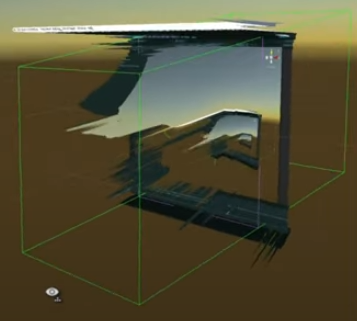

#### I think i'm the first to make real-time video to hologram generation.  
  

Real-time monocular depth estimation with [Intel/dpt-large](https://huggingface.co/Intel/dpt-large)  
Hologram [quilt](https://docs.lookingglassfactory.com/keyconcepts/quilts) generation with [ReGlass](https://github.com/jbienz/ReGlass) (which normally uses video game depth buffer)  

  

Output will be scattered irl with the plastic lenticular lens sheet  
Output looks like:  

  
